# OpenDI Model Hub - User Guide

## Introduction

A guide designed for end users and provides clear, step-by-step instructions for interacting with the OpenDI Model Hub application.

## Table of Contents

1. [Introduction](#introduction)
2. [Logging In](#logging-in)
3. [User Profile](#user-profile)
   - [Accessing Your Profile](#accessing-your-profile)
   - [Profile Information](#profile-information)
   - [Owned Models](#owned-models)
   - [Incoming Transfer Requests](#incoming-transfer-requests)
4. [Working with Models](#working-with-models)
   - [Viewing Models](#viewing-models)
   - [Model Privacy Settings](#model-privacy-settings)
   - [Sharing Models with Others](#sharing-models-with-others)
   - [Transferring Model Ownership](#transferring-model-ownership)
5. [Managing Models](#managing-models)
   - [Uploading Models](#uploading-models)
   - [Downloading Models](#downloading-models)
   - [Updating Models](#updating-models)
6. [Finding Models](#finding-models)
   - [Searching for Models](#searching-for-models)
7. [Model History and Lineage](#model-history-and-lineage)
   - [Viewing Model History (Commit Diffs)](#viewing-model-history-commit-diffs)
   - [Viewing Fork Information](#viewing-fork-information)
8. [Command-Line Interface (CLI)](#command-line-interface-cli)
   - [Prerequisites](#prerequisites)
   - [Accessing the CLI Download Page](#accessing-the-cli-download-page)
   - [Downloading the CLI](#downloading-the-cli)
   - [Getting Your Authentication Token](#getting-your-authentication-token)
   - [Installation](#installation)
   - [Getting Started](#getting-started)
   - [Common CLI Commands](#common-cli-commands)
   - [Getting Help](#getting-help)
   - [Troubleshooting](#troubleshooting)

---

## Logging In

The OpenDI Model Hub uses Google OAuth for secure authentication. This means you'll sign in using your existing Google account rather than creating a separate username and password.

### Steps to Log In:

1. Navigate to the OpenDI Model Hub homepage
2. Click the **LOGIN** button in the top-right corner of the navigation bar

   

3. You'll be directed to the login page, which displays a Google single sign-in option

   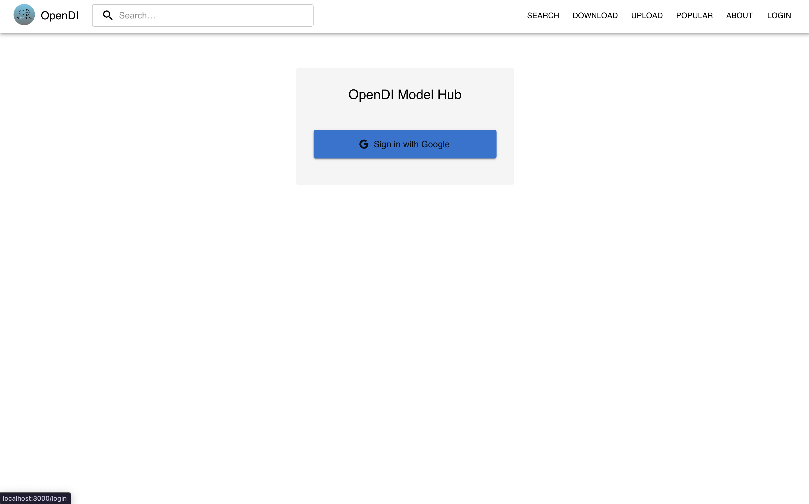

4. Click the **Sign in with Google** button

5. You'll be redirected to Google's authentication page where you can:
   - Select an existing Google account
   - Sign in with your Google credentials
   
6. After successful authentication, you'll be redirected back to the OpenDI Model Hub homepage

7. You'll now see your Google profile picture in the top-right corner instead of the LOGIN button, confirming you're signed in

   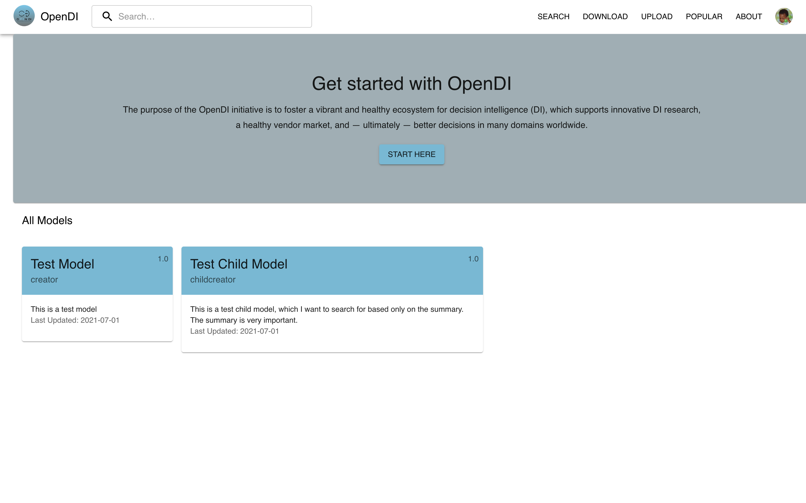

**Note:** If this is your first time logging in, a new account will be automatically created using your Google account information. You don't need to fill out any registration forms.

### Logging Out:

To log out, click on your profile picture in the top-right corner and select the logout option from the dropdown menu.

---

## User Profile

Your user profile displays your account information, models you own, and any pending transfer requests from other users.

### Accessing Your Profile

1. Click on your profile picture in the top-right corner of the navigation bar
2. Select **Profile** from the dropdown menu

   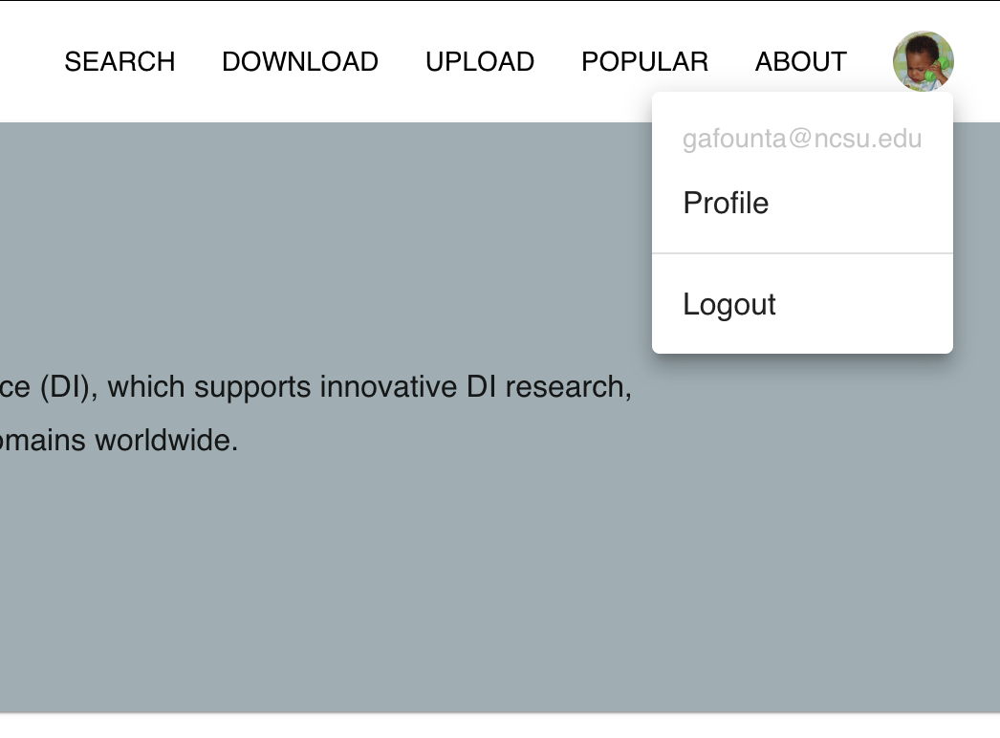

### Profile Information

Your profile displays:
- Your name
- Your email address
- Your profile picture (from your Google account)

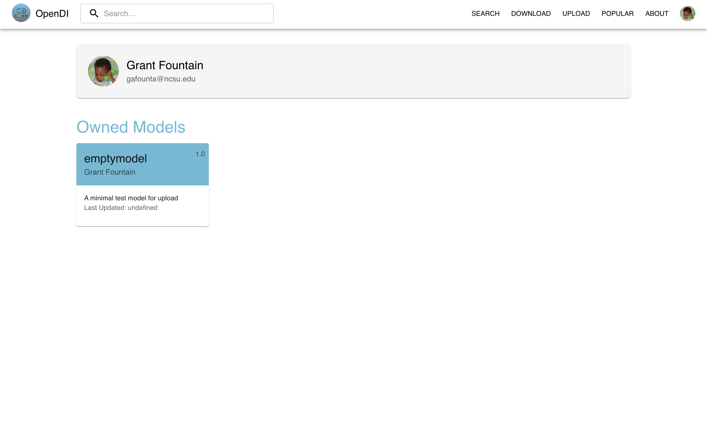

### Owned Models

The **Owned Models** section displays all models where you are the current owner. From here you can:
- Click on any model to view its details
- Manage model settings
- Transfer ownership to another user

If you don't own any models yet, you'll see the message "You do not own any models."

### Incoming Transfer Requests

When another user transfers ownership of a model to you, it appears in the **Incoming Transfer Requests** section with two options:

- **ACCEPT** - Accept ownership of the model (it will move to your Owned Models)
- **DECLINE** - Reject the transfer (ownership remains with the original owner)

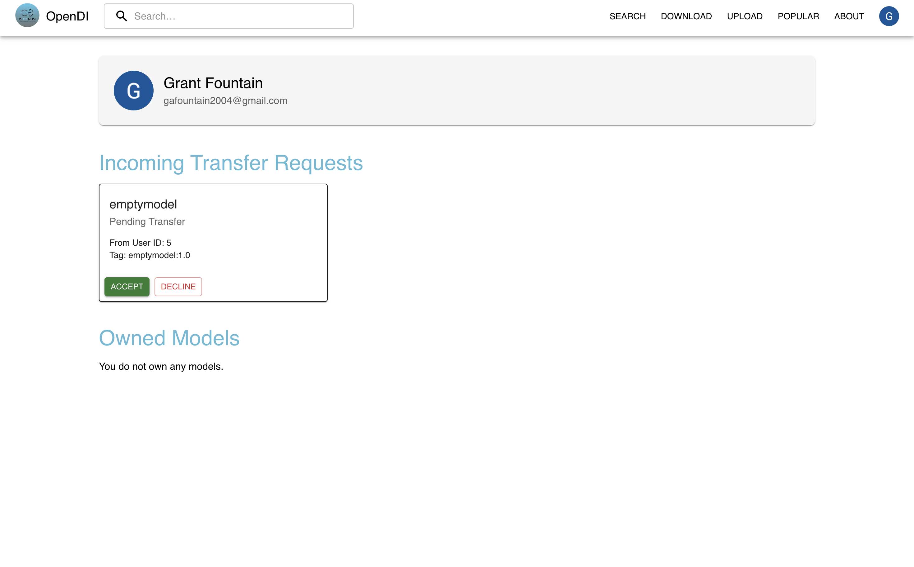

The transfer request card shows:
- Model name
- Transfer status: "Pending Transfer"
- Original owner: "From User ID: [number]"
- Model tag

**Note:** Once you accept a transfer, you become the full owner of the model and the previous owner loses access unless you explicitly share it with them.

---

## Working with Models

### Viewing Models

If you click on any of the models, then you'll be directed to that model's detail page.


When viewing a model's detail page, you'll see several tabs that organize different aspects of the model:

#### Available Tabs:

1. **OVERVIEW** - Displays the model's description and summary
2. **DOCUMENTATION** - Contains detailed documentation about the model (if provided by the model creator)
3. **COMMIT DIFF** - Shows version history and differences between model versions
4. **FORK INFO** - Displays parent lineage and child models
5. **OWNERSHIP** - Allows the owner to transfer ownership to another user

#### Model Metadata:

At the top of each model page, you'll see:
- Model name (large heading)
- Creator information: "By: [Username]"
- Tags (if any): Displayed as clickable badges (Tag 1, Tag 2, etc.)
- Privacy status: Toggle showing Public or Private
- Share button: Icon to share the model with others
- Download button: Download the model as a JSON file
- Update button: Upload a new version of the model


---

### Model Privacy Settings

Models can be set as either **Public** or **Private**, controlling who can view and access them.

#### Public vs. Private Models:

- **Public**: Anyone can view and download the model from the OpenDI Model Hub
- **Private**: Only you (the owner) and users you've explicitly shared with can access the model

#### Changing Privacy Settings:

1. Navigate to your model's detail page by clicking on it from the homepage or from your profile's "Owned Models" section

2. Locate the privacy toggle near the top of the page, below the model name and creator information

   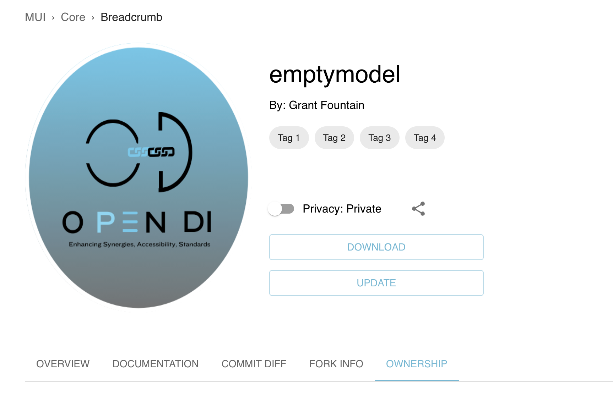

3. Click the toggle switch to change between Private and Public

   - Toggle **OFF** (left) = Private
   - Toggle **ON** (right) = Public

4. The privacy setting is saved immediately when you toggle it

**Note:** Only the model owner can change privacy settings. If you have read or read/write access to someone else's model, you cannot change its privacy status.

---

### Sharing Models with Others

If you own a model, you can share it with specific users by granting them access permissions. This is useful for private models that you want to collaborate on with specific team members.

#### Permission Levels:

- **Read**: User can view and download the model but cannot make changes
- **Read/Write**: User can view, download, and update the model

#### How to Share a Model:

1. Navigate to your model's detail page

2. Click the **Share icon** (looks like 3 dots connected by 2 lines) located next to the privacy toggle

   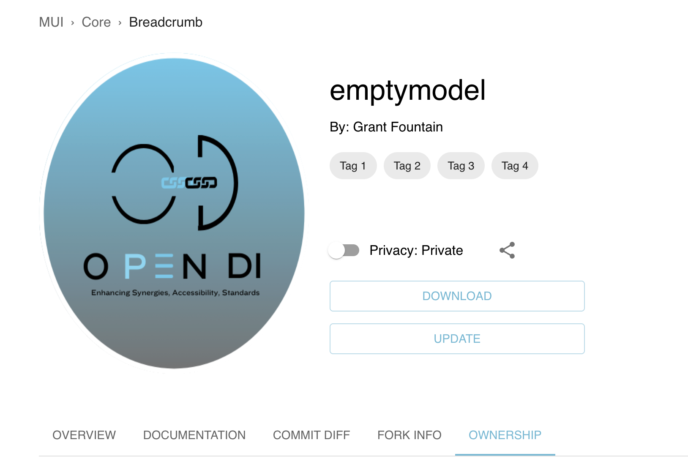

3. A "Share Settings" dialog will appear

   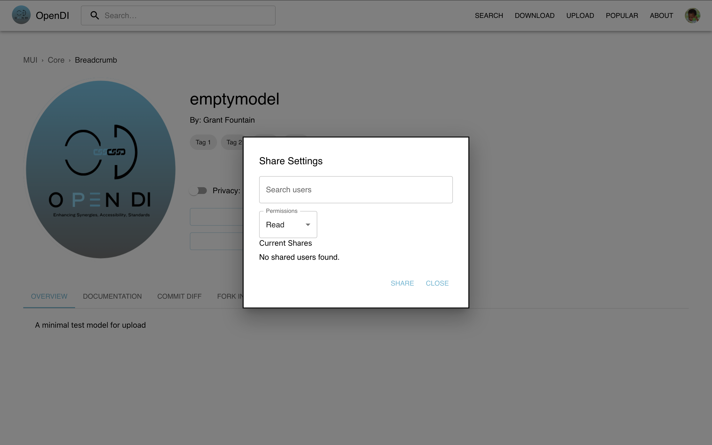

4. In the "Search users" field, enter the email address of the user you want to share with

5. Select the permission level from the dropdown:

   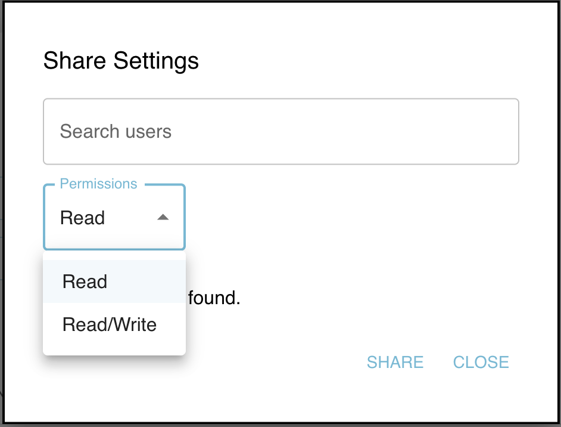

   - **Read** - View and download only
   - **Read/Write** - Full editing access

6. Click the **SHARE** button to grant access

#### Current Shares:

The dialog displays all users who currently have access to the model under "Current Shares"

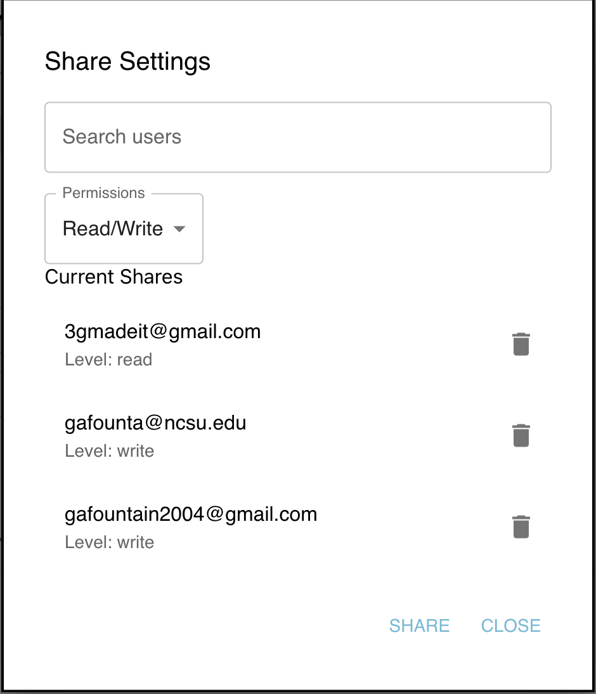

#### Removing Access:

To revoke a user's access:
1. Find them in the "Current Shares" list
2. Click the **trash can icon** next to their name
3. Their access will be removed immediately

#### Closing the Dialog:

Click the **CLOSE** button to exit the share settings dialog without making changes.

**Notes:**
- You can only share models that you own
- Users must have an OpenDI Model Hub account (must have logged in at least once) to be shared with
- Sharing does not transfer ownership (you remain the owner and can revoke access at any time)

---

### Transferring Model Ownership

As a model owner, you can permanently transfer ownership to another user. This gives them full control over the model, including the ability to modify, share, or delete it.

**Important:** Ownership transfer is permanent. Once you transfer a model, you are no longer the owner and will lose access unless the new owner shares it back with you.

#### How to Transfer Ownership:

1. Navigate to your model's detail page

2. Click on the **OWNERSHIP** tab at the top of the model details

   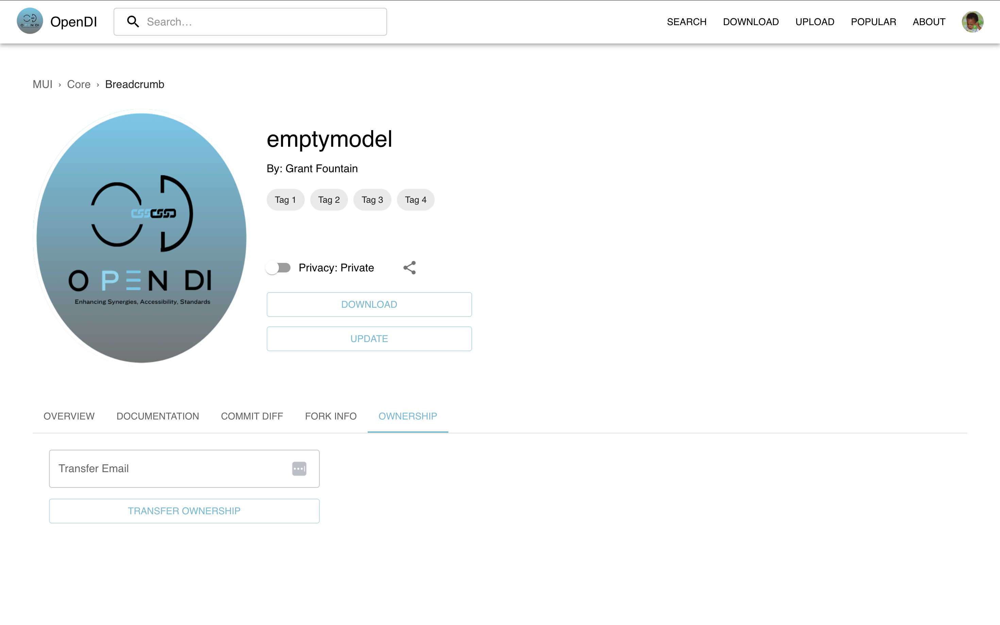

3. In the "Transfer Email" field, enter the email address of the user you want to transfer ownership to

4. Click the **TRANSFER OWNERSHIP** button

5. A transfer request will be sent to the recipient

6. While the transfer is pending, you'll see a message: "A transfer request is currently pending"

   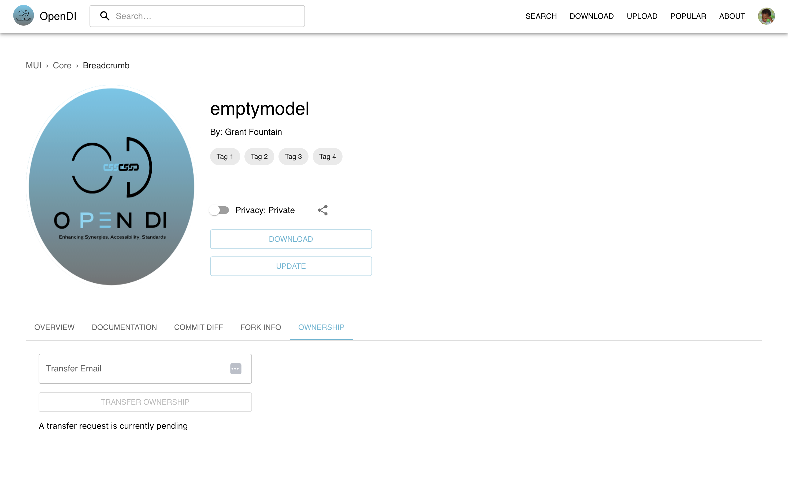

#### For Recipients - Accepting or Declining Transfers:

If someone transfers a model to you:

1. Click on your profile picture in the top-right corner
2. Go to your **Profile** page
3. Look for the model in the "Incoming Transfer Requests" section

   

4. Review the transfer details:
   - Model name
   - Original owner ID
   - Model tag

5. Click **ACCEPT** to become the new owner, or **DECLINE** to reject the transfer

#### What Happens After Transfer:

- **If Accepted**: The recipient becomes the full owner and the model appears in their "Owned Models"
- **If Declined**: Ownership remains with the original owner
- **Original Owner**: Loses ownership and access (unless explicitly shared back by new owner)

**Notes:**
- Only one transfer request can be pending at a time per model
- You cannot cancel a pending transfer once sent
- The recipient must have an OpenDI Model Hub account to accept transfers

---

## Managing Models

### Uploading Models

If you click the **Upload** button in the navigation bar, you'll be directed to the model upload page.

**Note:** You must be logged in to upload models. If you try to access the upload page without logging in, you'll see a locked icon and be prompted to log in first.

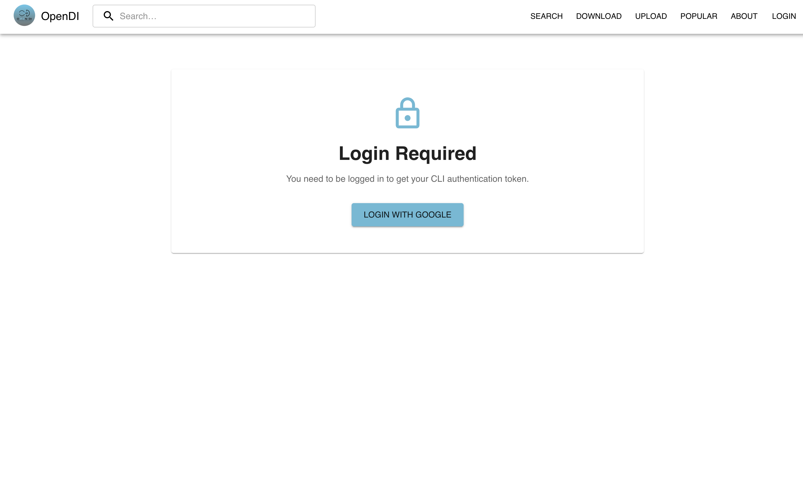

Once logged in, you can upload a model. The user can either drag and drop a .json model file or click the dotted box under **My Assets** to select a .json file from the file explorer.

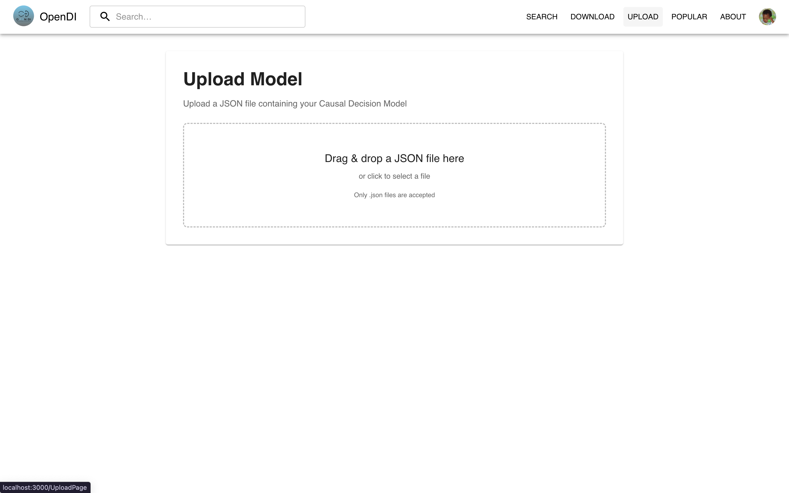

#### Steps to Upload:

1. Click the **UPLOAD** button in the navigation bar
2. You'll be directed to the model upload page
3. You can either:
   - **Drag and drop** a .json model file onto the dotted box
   - **Click** the dotted box to open a file selector and choose a .json file from your computer
**Note:** Only .json files are accepted. The JSON must conform to the OpenDI Causal Decision Model format.

---

### Downloading Models

If the user navigates to a model detail page and clicks the Download
button, they will be prompted to choose a location in their file system
to save the model.

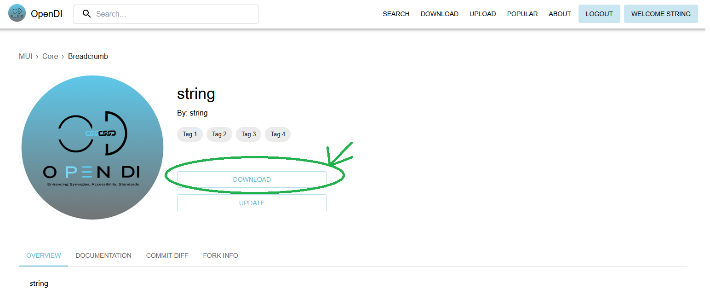

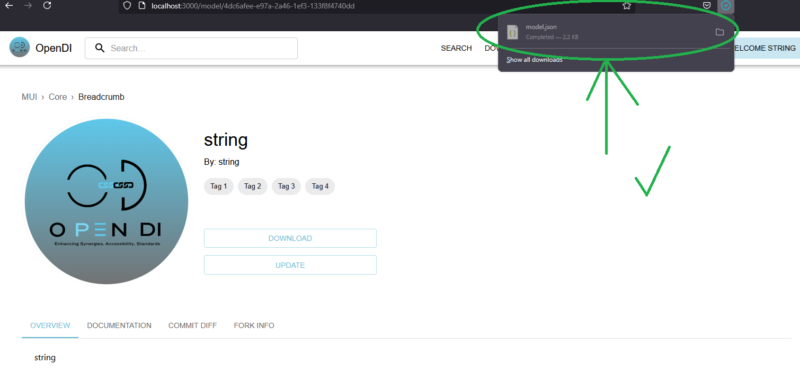

---

### Updating Models

If you navigate to a model detail page and click the **UPDATE** button, you will be prompted to upload a .json file to update the current model.

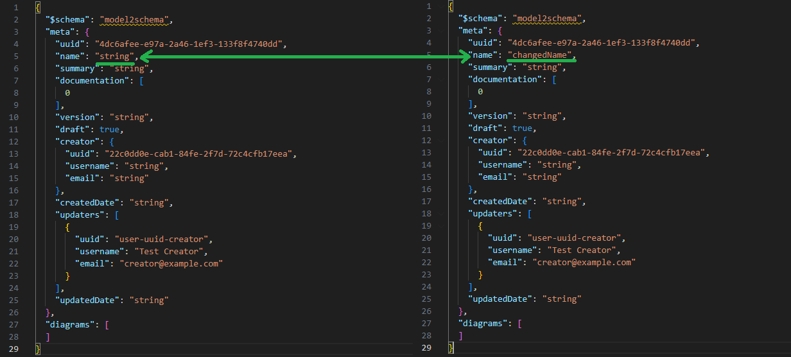

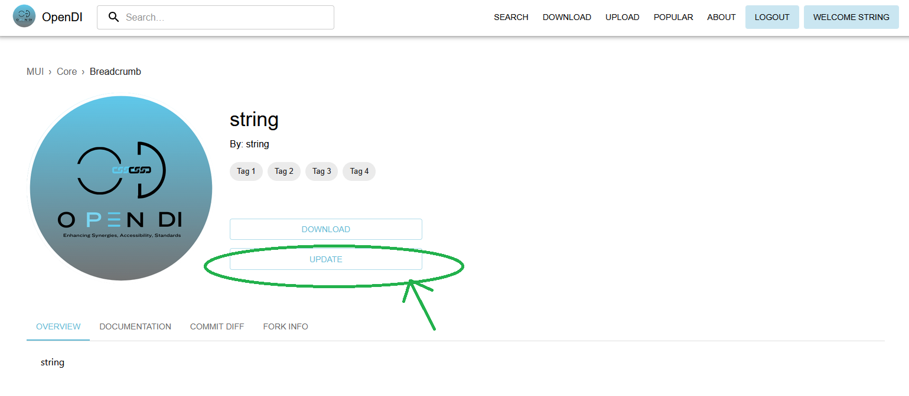

#### Steps to Update:

1. Navigate to your model's detail page
2. Click the **UPDATE** button
3. Select a JSON file containing the updated model
4. The system will create a new version and track the changes in the commit history

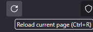

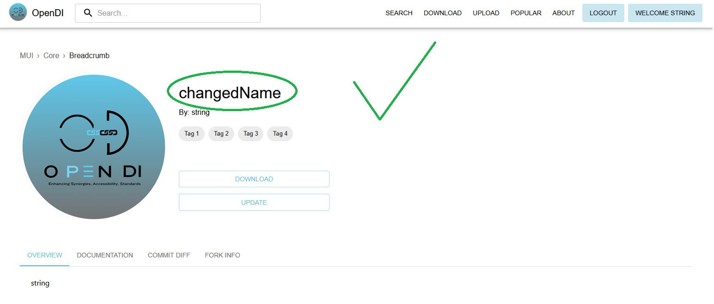

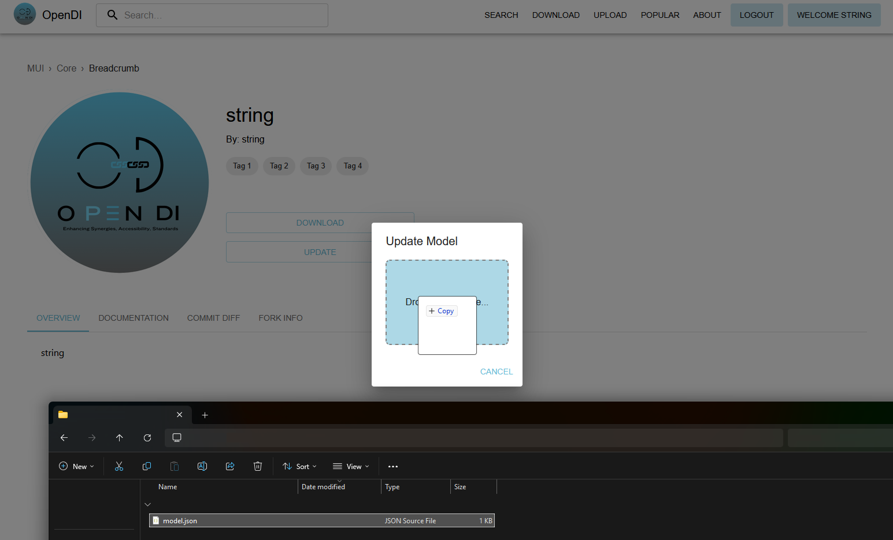

**Important Notes:**
- Only model owners or users with read/write permissions can update models
- Updates create a new version in the model's history
- Changes are tracked and visible in the COMMIT DIFF tab
- If you update a component (like a diagram) that is shared by multiple models, you must update the UUID for that component, or it will be rolled back to maintain consistency

---

## Finding Models

### Searching for Models

If you click the **Search** button in the navigation bar, you will be directed to a search page where you can look for models and filter results by model name or creator name.

Alternatively, if you search for a model directly using the search bar in the navigation bar, you will be directed to the search page with the results already populated.

#### Using the Search Page:

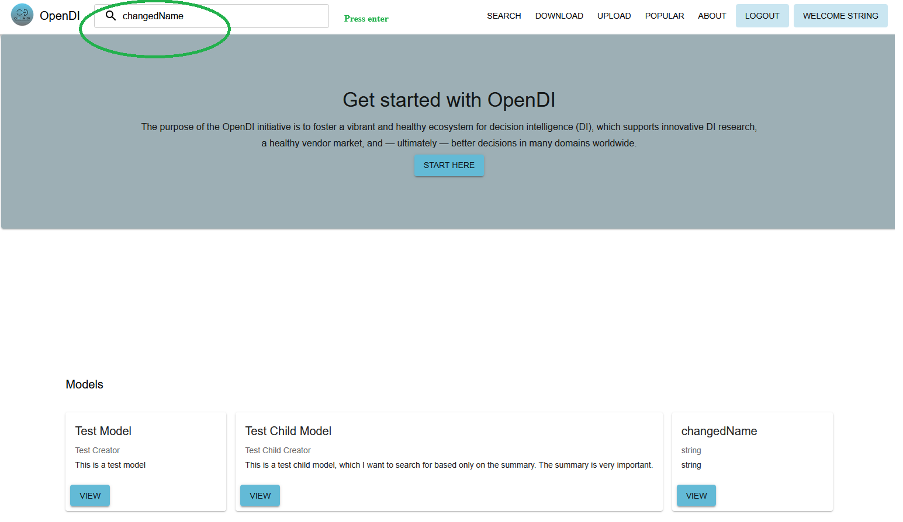

1. Click the **SEARCH** button in the navigation bar, or type in the search bar
2. On the search page, you can filter by:
   - **Model Name** - Search by the model's title or summary
   - **Creator Name** - Search by the username of the model's creator
3. Enter your search term
4. Press **Enter** or click the search icon
5. Results matching your criteria will be displayed

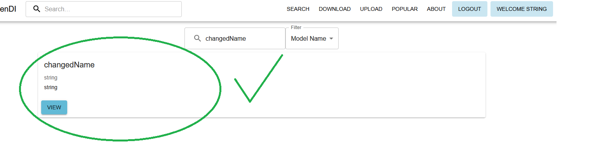

#### Alternative - Direct Search from Navbar:

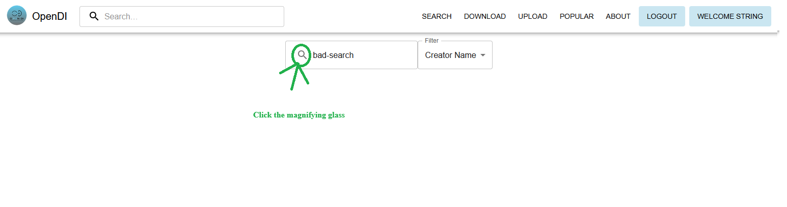

1. Type your search term directly into the search bar in the navigation bar
2. Press **Enter**
3. You'll be taken to the search results page with results already populated

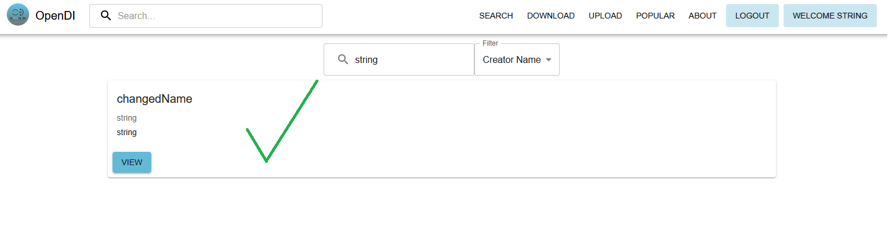

---

## Model History and Lineage

### Viewing Model History (Commit Diffs)

If you navigate to a model detail page and click the **COMMIT DIFF** tab, you will see a dropdown list that will let you see the version history of any model.

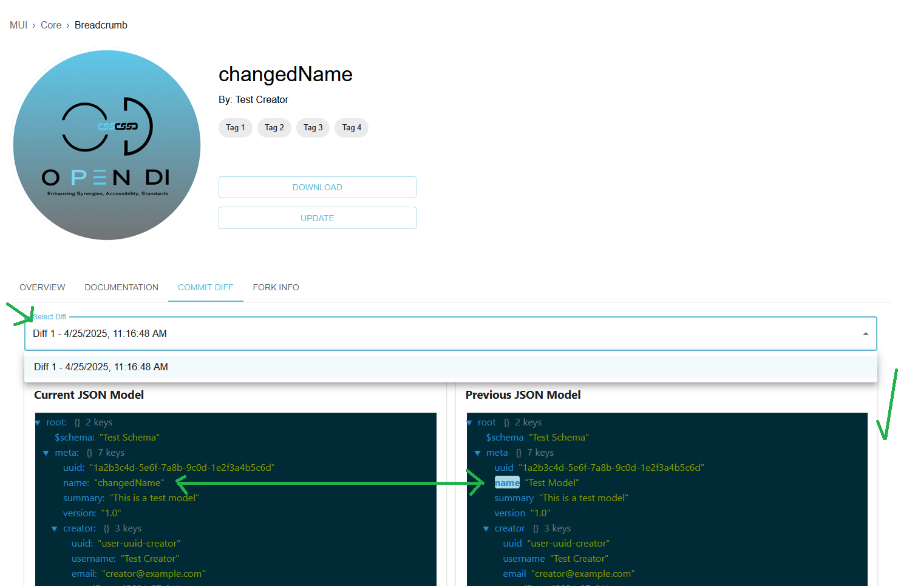

#### Understanding Commit Diffs:

- **Current JSON Model** - Shows the current version of the model
- **Previous JSON Model** - Shows the selected previous version
- **Differences highlighted** - Changes between versions are highlighted in different colors

This allows you to:
- Track how the model has evolved over time
- See what changed in each update
- Understand who made which changes
- Revert to previous versions if needed

---

### Viewing Fork Information

If you navigate to a model detail page and click the **FORK INFO** tab, you will see the model's parent lineage as well as any child models it may have.

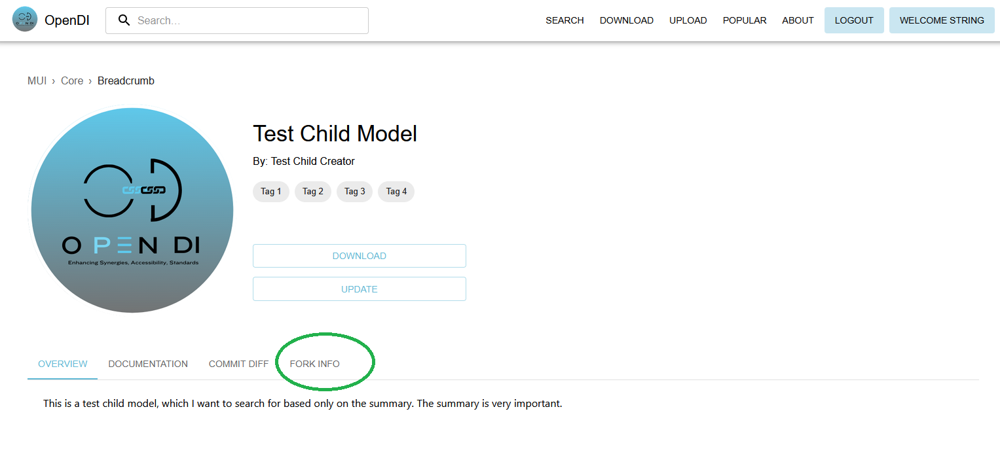

#### Parent Lineage:

Shows the ancestry of the current model. If the model was forked from another model, you'll see:
- The parent model's name
- The full lineage chain back to the root model
- Or "No parent lineage present. This is a root model." if it has no parent

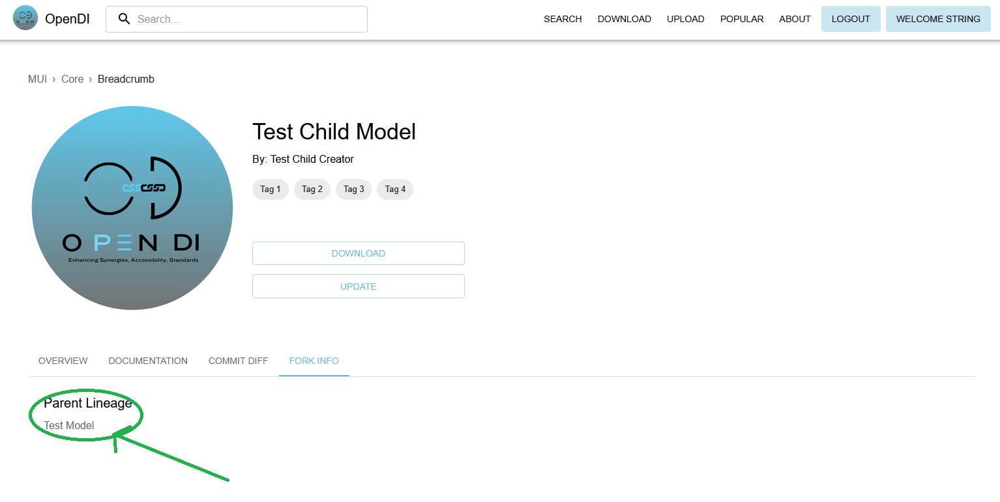

#### Child Models:

Shows any models that have been forked from this model. Clicking on any of the listed models will direct you to that model's detail page.

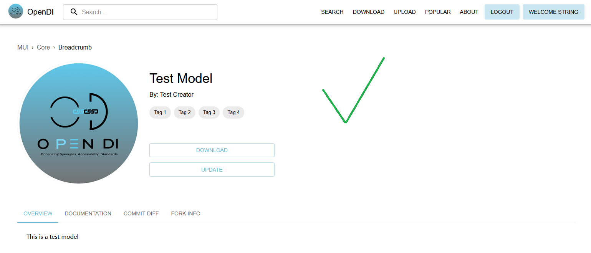

---

## Command-Line Interface (CLI)

The OpenDI CLI is a command-line tool that allows you to manage your models directly from your terminal. You can upload, download, and manage models without using the web interface.

### Prerequisites

- You must be logged in to the OpenDI Model Hub to access the CLI download page
- Your system must support executable files (Windows .exe provided)

### Accessing the CLI Download Page

1. Ensure you're logged in to the OpenDI Model Hub

2. Click the **DOWNLOAD** button in the navigation bar

#### If Not Logged In:

If you try to access the download page without logging in, you'll see:


- A lock icon
- Message: "Login Required"
- Text: "You need to be logged in to get your CLI authentication token"
- **LOGIN WITH GOOGLE** button

Click the login button and authenticate before continuing.

### Downloading the CLI

Once logged in, the download page displays:

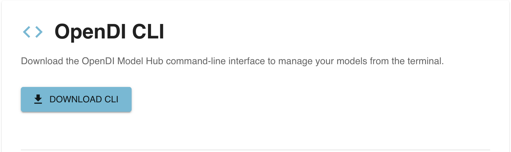

1. At the top of the page, you'll see the OpenDI CLI logo and description:
   - "Download the OpenDI Model Hub command-line interface to manage your models from the terminal"

2. Click the **DOWNLOAD CLI** button to download the executable

### Getting Your Authentication Token

The CLI requires an authentication token to connect to your account.

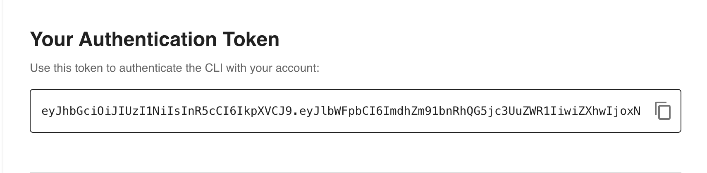

1. Locate the "Your Authentication Token" section on the download page

2. You'll see a long token string (it looks like: `eyJhbGc1OiJIUzI1NiIsInR5cCI6IkpXVCJ9...`)

3. Click the **copy icon** on the right side of the token box to copy it to your clipboard

**Important:** Keep this token secure! It provides access to your account from the command line.

### Installation

The download page provides step-by-step installation instructions:

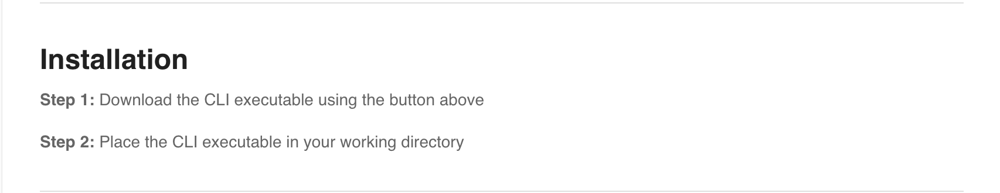

**Step 1:** Download the CLI executable using the button above

**Step 2:** Place the CLI executable in your working directory
- Or add it to your system PATH for access from anywhere

### Getting Started

After installation, follow these steps to configure and use the CLI:

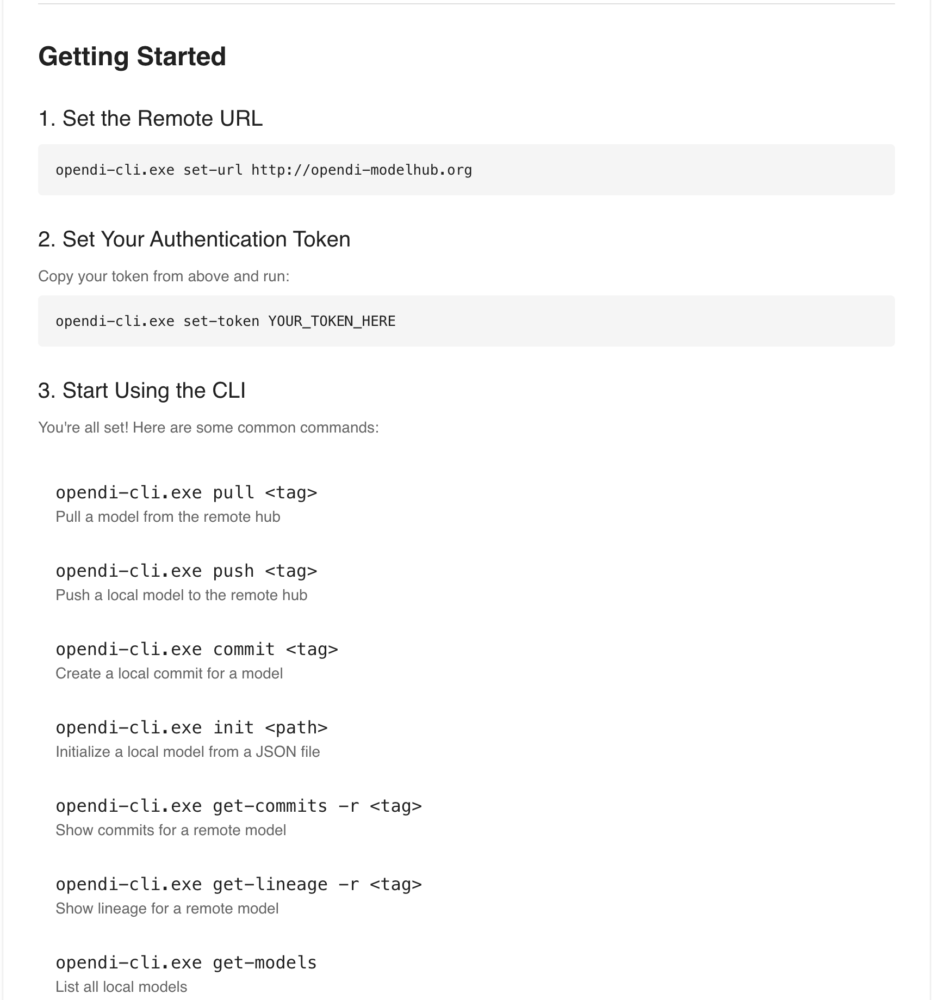

#### 1. Set the Remote URL
```bash
opendi-cli.exe set-url http://opendi-modelhub.org
```

This tells the CLI where to find the OpenDI Model Hub backend.

#### 2. Set Your Authentication Token

Copy your token from above and run:
```bash
opendi-cli.exe set-token YOUR_TOKEN_HERE
```

Replace `YOUR_TOKEN_HERE` with the actual token you copied.

#### 3. Start Using the CLI

You're all set! See the common commands below.

### Common CLI Commands

**Pull a model from the remote hub:**
```bash
opendi-cli.exe pull <tag>
```
Example: `opendi-cli.exe pull mymodel:1.0`

**Push a local model to the remote hub:**
```bash
opendi-cli.exe push <tag>
```
Example: `opendi-cli.exe push mymodel:1.0`

**Create a local commit for a model:**
```bash
opendi-cli.exe commit <tag>
```

**Initialize a local model from a JSON file:**
```bash
opendi-cli.exe init <path>
```
Example: `opendi-cli.exe init ./mymodel.json`

**Show commits for a remote model:**
```bash
opendi-cli.exe get-commits -r <tag>
```

**Show lineage for a remote model:**
```bash
opendi-cli.exe get-lineage -r <tag>
```

**List all local models:**
```bash
opendi-cli.exe get-models
```

**Logout (clear stored token):**
```bash
opendi-cli.exe clear-token
```

### Getting Help

For more information and options, run:
```bash
opendi-cli.exe -h
```

This displays the full help documentation with all available commands and flags.

### Troubleshooting

- **"Authentication failed"**: Your token may have expired. Generate a new token from the download page
- **"Command not found"**: Ensure the CLI executable is in your current directory or added to your system PATH
- **"Model not found"**: Check that you're using the correct tag and that you have access to the model

---
