# Introduction

A guide designed for end users and provides clear, step-by-step
instructions for interacting with the application.

# Table of Contents

[**Introduction 2**](#introduction)

[**Table of Contents 2**](#table-of-contents)

[**Core Features and Use Cases 3**](#core-features-and-use-cases)

> [Logging In 3](#logging-in)
>
> [Uploading Models 4](#uploading-models)
>
> [Viewing Models 5](#viewing-models)
>
> [Downloading Models 6](#downloading-models)
>
> [Updating Models 7](#updating-models)
>
> [Searching for Models 10](#searching-for-models)
>
> [Viewing History of Models 11](#viewing-history-of-models)
>
> [Viewing Fork Information of Models
> 12](#viewing-fork-information-of-models)

# 

#   {#section-1}

# Core Features and Use Cases

## Logging In

If the user clicks on the *Login* button in the top right corner of the
navigation bar, then they can sign in using their email address and
password.

**Note:** New users will be automatically created upon logging in for
the first time.

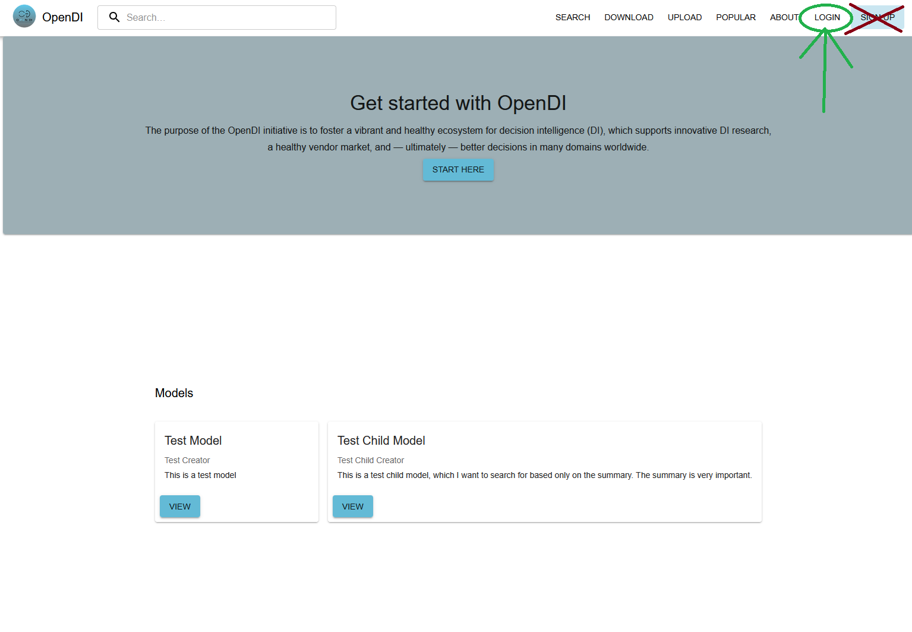

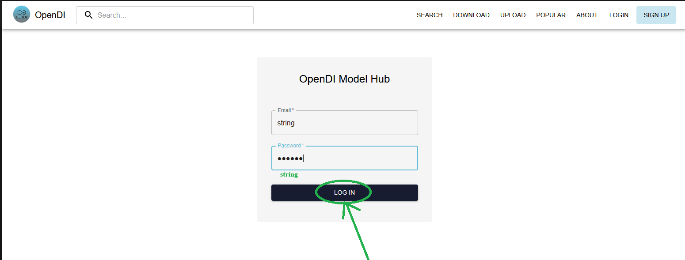

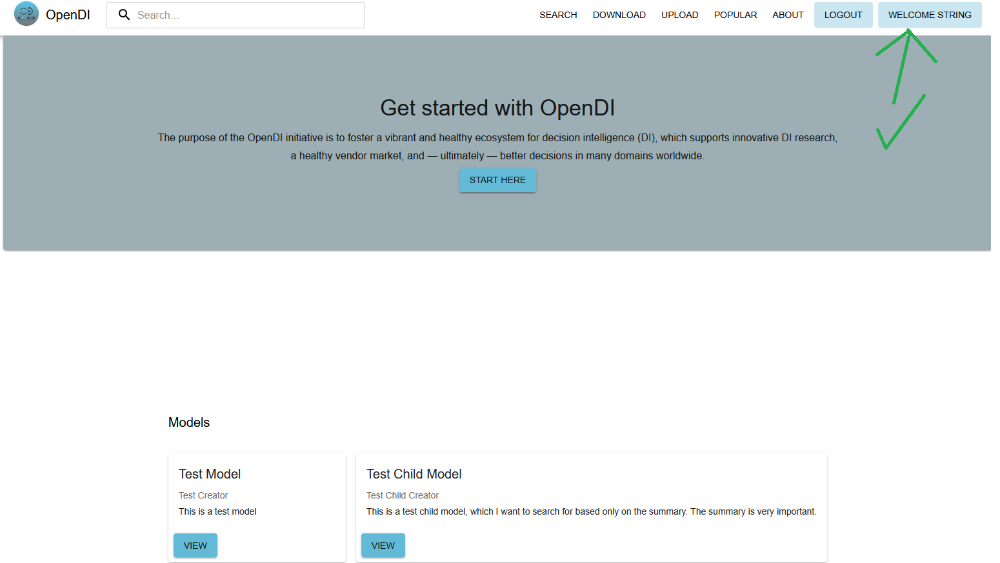

## Uploading Models

If the user clicks the *Upload* button in the navigation bar, then they
will be directed to the model upload detail page. The user can either
drag and drop a .json model file or click the dotted box under **My
Assets** to select a .json file from the file
explorer.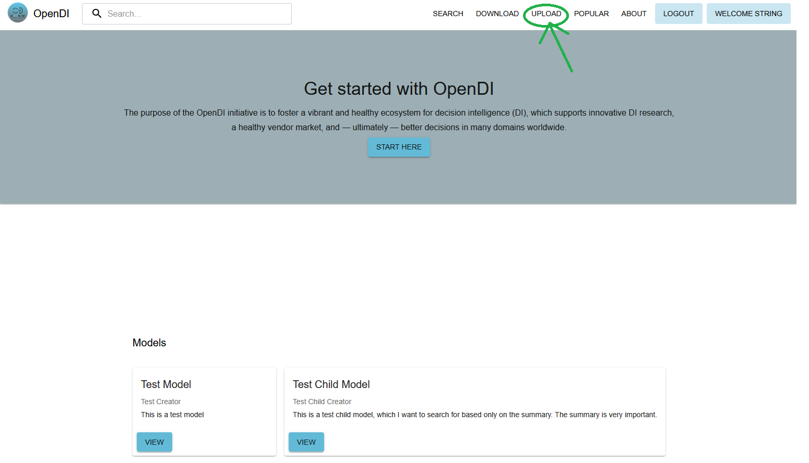{width="6.5in"
height="3.7239588801399823in"}

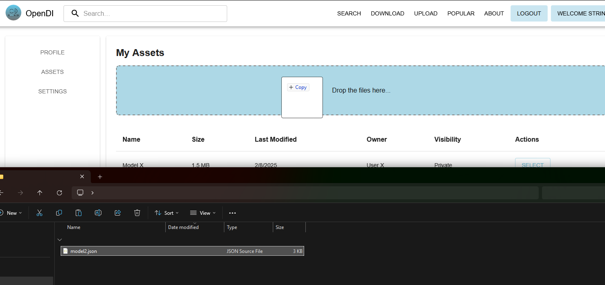

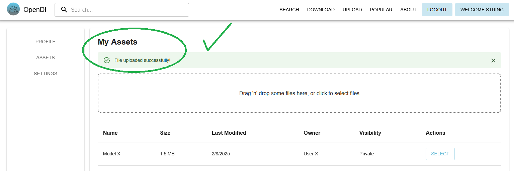

## Viewing Models

If the user clicks the *View* button for any of the models on the home
page, then they will be directed to the model detail page.

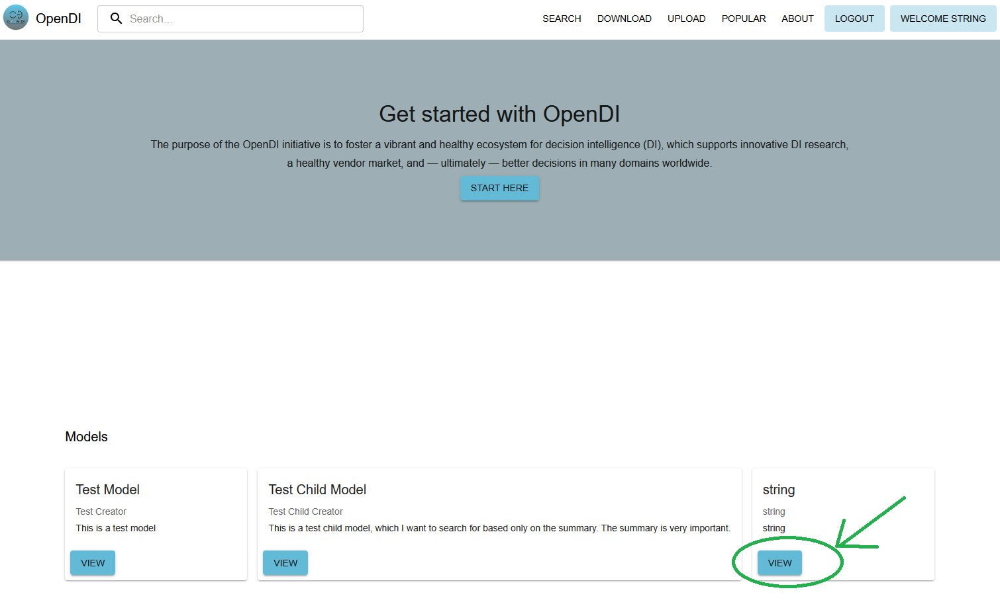

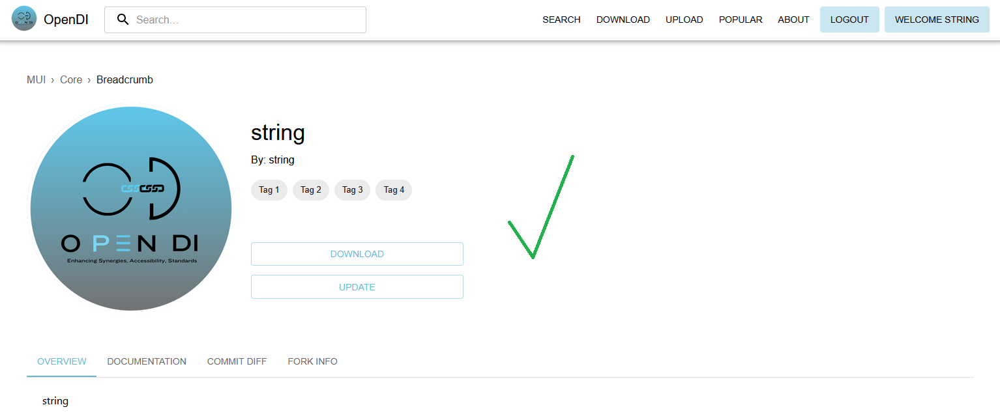

## Downloading Models

If the user navigates to a model detail page and clicks the Download
button, they will be prompted to choose a location in their file system
to save the model.

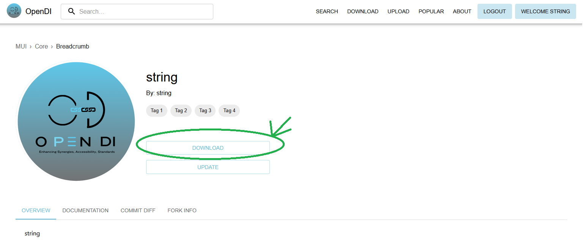

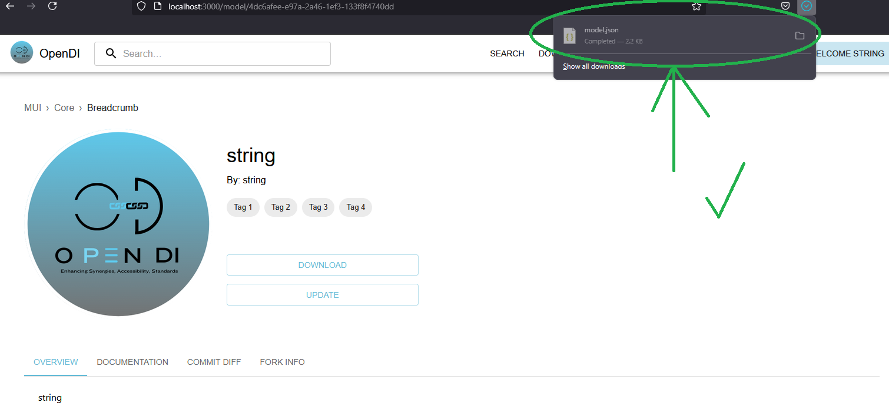

## Updating Models

If the user navigates to a model detail page and clicks the *Upload*
button, they will be prompted to upload a .json file to update the
current model. It is important to note that in this current state if you
update a component of a model that is potentially used by other models
it will be rolled back unless you also update the UUID for this
component.

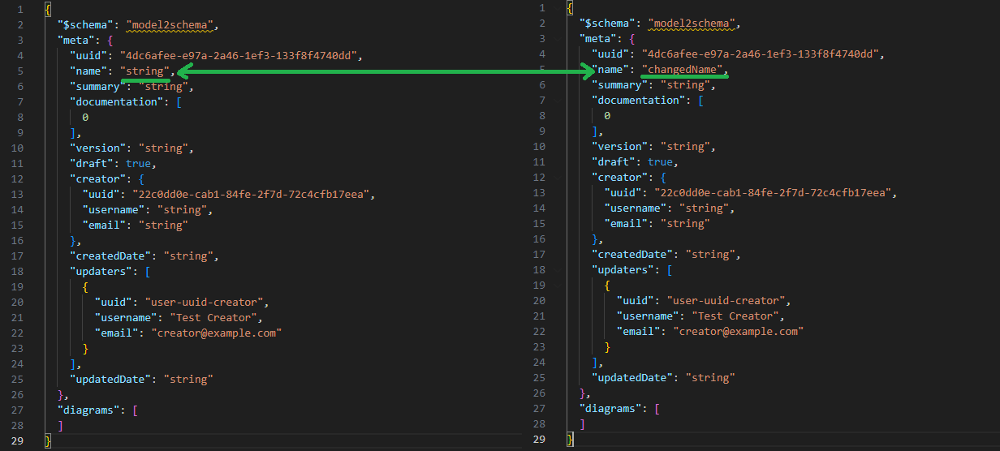

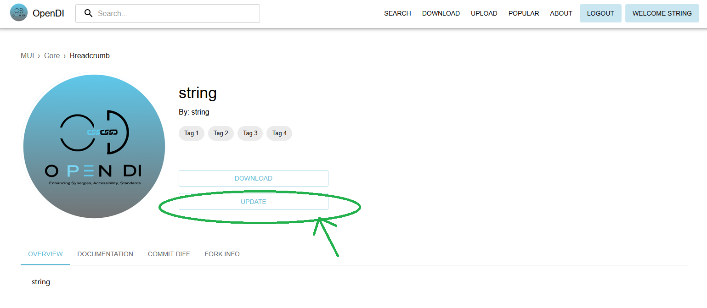

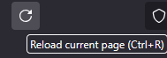
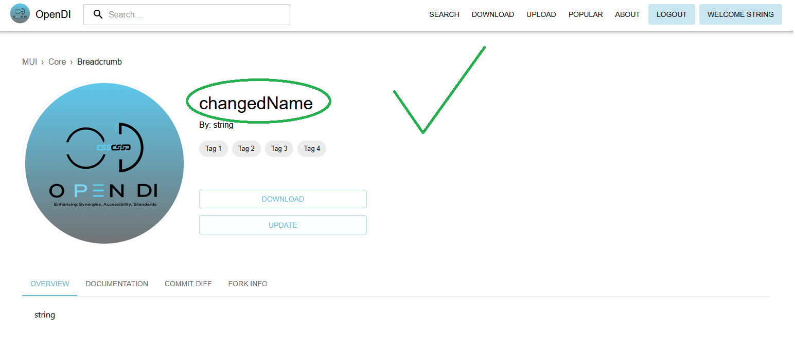
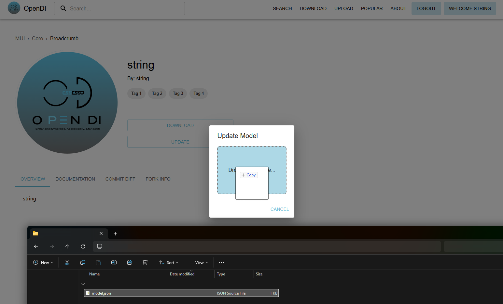

## Searching for Models

If the user clicks the *Search* button in the navigation bar, they will
be directed to a search page where they can look for models and filter
results by model name or creator name.

Alternatively, if the user searches for a model directly using the
search bar in the navigation bar, they will be directed to the search
page with the results already populated.

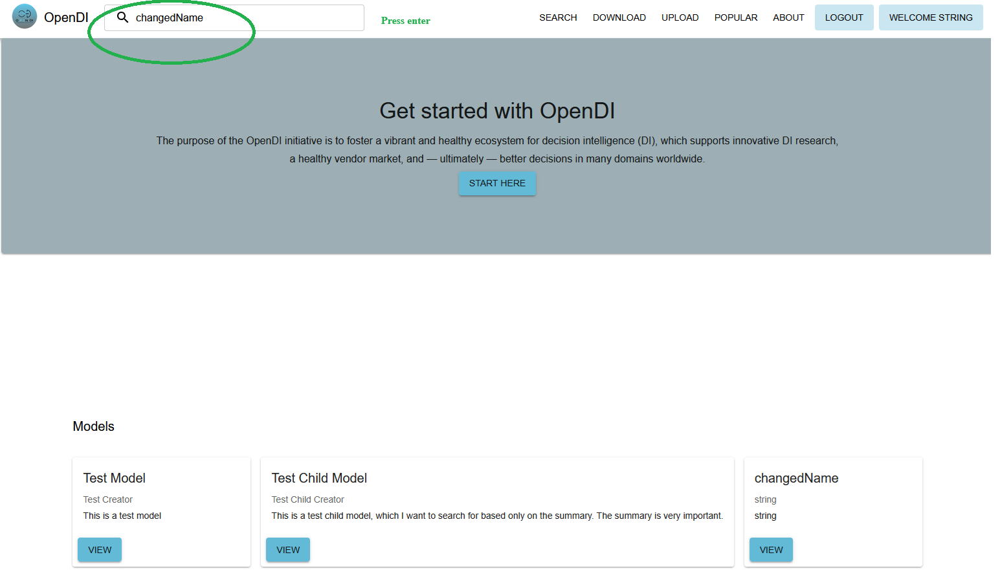

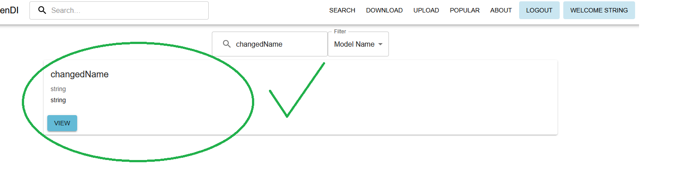

Alternatively...

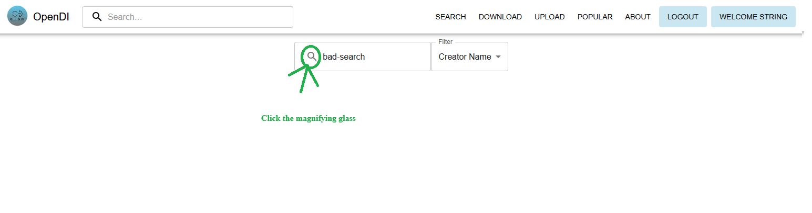

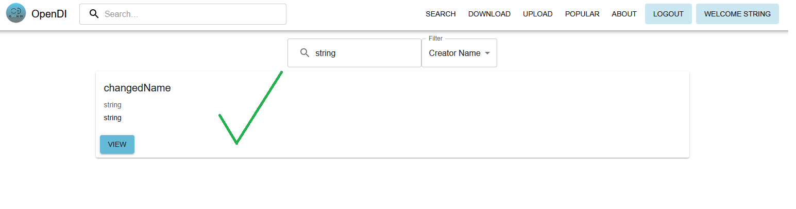

## Viewing History of Models

If the user navigates to a model detail page and clicks the *COMMIT
DIFF* tab, they will see a drop down list that will let them see the
version history of any model.

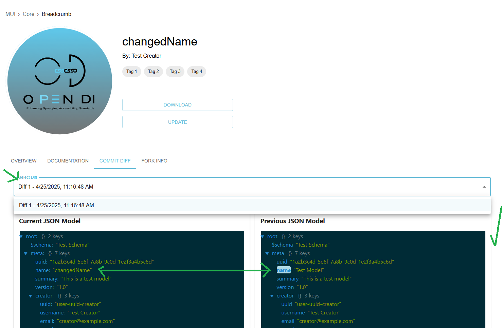

## Viewing Fork Information of Models

If the user navigates to a model detail page and clicks the *FORK INFO*
tab, they will see the model\'s parent lineage as well as any child
models it may have. Clicking on any of the listed models will direct the
user to that model's detail page.

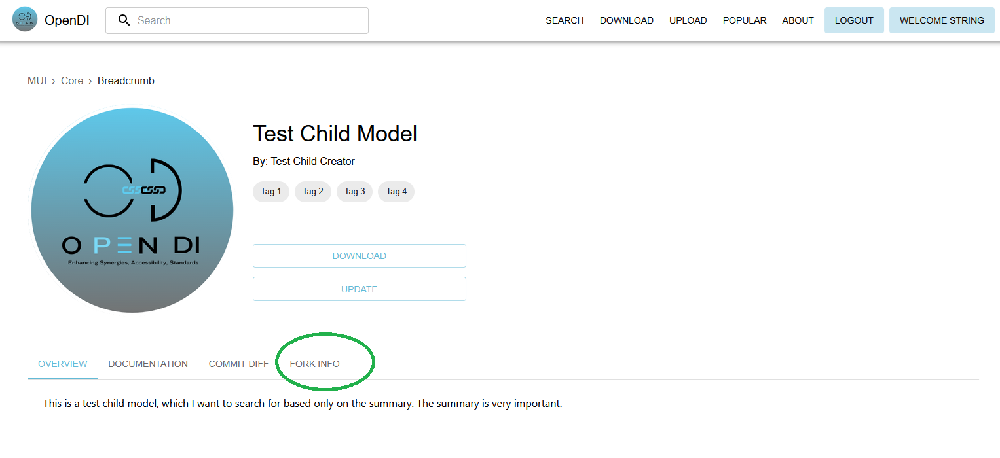

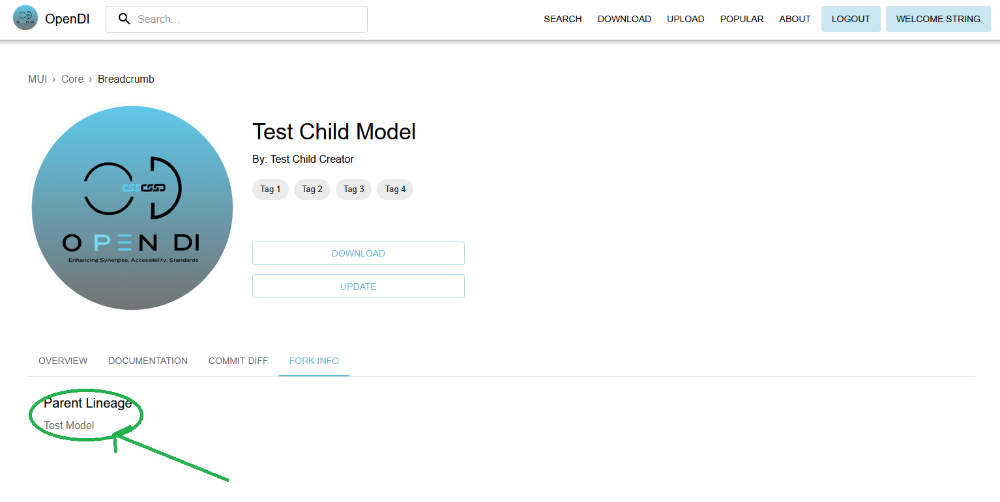

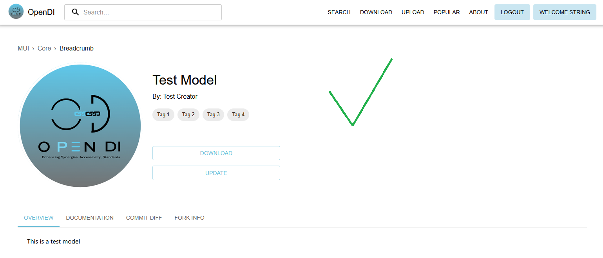

