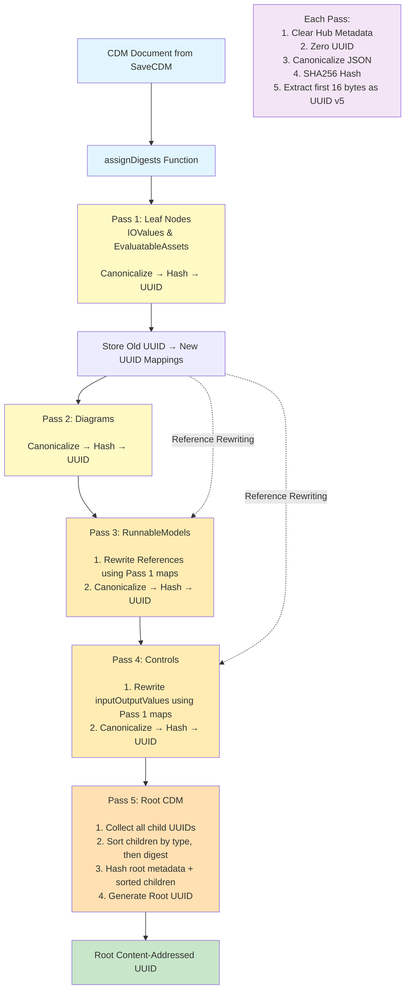

# Content-Addressed Deduplication Logic

## Overview

This diagram explains the 5-pass deduplication algorithm in `api/internal/database/digest.go` that assigns content-addressed UUIDs to CDM documents.

## Core Principle

**Content-Addressing: Same Content → Same UUID**

Using SHA256 hash + JSON canonicalization to ensure identical content always produces identical UUIDs.

## Deduplication Flow



## Pass Details

### Pass 1: Leaf Nodes (IOValues & EvaluatableAssets)
- **Why First?** No dependencies on other CDM children
- **Purpose:** Establish base content-addressed UUIDs
- **Output:** Old UUID → New UUID mapping for reference rewriting

### Pass 2: Diagrams
- **Why Independent?** No cross-references to other children
- **Purpose:** Generate content-addressed UUIDs for diagrams

### Pass 3: RunnableModels
- **Dependencies:** References IOValues and EvaluatableAssets
- **Process:**
  1. Rewrite references using Pass 1 mappings
  2. Then canonicalize and hash

### Pass 4: Controls
- **Dependencies:** References IOValues in inputOutputValues array
- **Process:**
  1. Rewrite inputOutputValues using Pass 1 mappings
  2. Then canonicalize and hash

### Pass 5: Root CDM
- **Dependencies:** All child UUIDs from Passes 1-4
- **Process:**
  1. Collect all child UUIDs
  2. Sort children (by type, then digest) for order-independence
  3. Hash root metadata + sorted children list
  4. Generate final root content-addressed UUID

## Key Operations (Common to All Passes)

1. **Canonicalize JSON** - Sort keys for stable byte representation
2. **Clear Hub Metadata** - Strip creator, updator, timestamps
3. **Zero UUID** - Remove old UUID before hashing
4. **Hash Content** - Compute SHA256 and extract first 16 bytes
5. **Assign UUID** - Format as RFC 4122 UUID version 5

## Export Instructions

### Using Mermaid CLI
```bash
# Install Mermaid CLI
npm install -g @mermaid-js/mermaid-cli

# Export to PNG (for poster)
mmdc -i deduplication-diagram.md -o deduplication-diagram.png -w 2400

# Export to SVG (scalable)
mmdc -i deduplication-diagram.md -o deduplication-diagram.svg
```

### Using Mermaid Live Editor
1. Visit https://mermaid.live
2. Copy the diagram code (between ```mermaid```)
3. Paste into editor
4. Download as PNG or SVG using the download button

### Using VS Code
1. Install "Markdown Preview Mermaid Support" extension
2. Open this file and preview
3. Right-click diagram → Export as image
